---
format:
  revealjs:
    logo: ../../resources/logos/unilu_logo.png
    chalkboard: true

bibliography: ../../resources/bibliography/references.bib

title-slide-attributes:
  data-state: "hide-ui"

resources:
  - "../../resources/images/clinician_patient.png"
  - "../../resources/**"

# --- CUSTOMIZE ALL SIZES/COLORS HERE ---
title-config:
  # ==========================================
  # 1. LAYOUT & COMPONENT DIMENSIONS
  # ==========================================
  sidebar-width: "100px"   
  title-image-size: "450px"
  logo-height: "65px"
  content-logo-height: "75px"

  # ==========================================
  # 2. GLOBAL COLOR PALETTE
  # ==========================================
  # Core Brand Colors
  title-color: "#004D7A"      # Main headings and emphasized text
  card-red: "#D3362A"         # Accent borders, icons, and warnings
  card-blue: "#004D7A"        # Secondary card accents
  sidebar-color: "#1A2E3B"    # Dark blue used for sidebars and backgrounds
  orcid-color: "#A6CE39"      # Standard ORCID green
  
  # Backgrounds
  bg-light: "#F0F4F8"         # Soft blue/grey background for standard cards
  bg-light-red: "#FDF2F2"     # Soft red background for warning/error cards
  
  # Typography & Borders
  text-main: "#4B5563"        # Standard body text (dark grey)
  text-muted: "#777777"       # Secondary/subtle text (lighter grey)
  subtitle-accent: "#c04343"  # Light blue/grey for slide subtitles
  border-main: "#E2E8F0"      # Subtle borders for cards and dividers
  
  # Status & Action Colors
  success-green: "#2ecc71"    # Positive evaluation checkmarks and borders
  error-red: "#e74c3c"        # Negative evaluation crosses
  
  # Component Specific (CV)
  cv-date-color: "#EFA49B"    # Pale red/pink for past CV dates
  cv-line-color: "#6B7280"    # Grey for the connecting timeline

  # ==========================================
  # 3. TYPOGRAPHY SCALE
  # ==========================================
  # Title Slide & Specific Slide Elements
  title-size: "60pt"          # Main presentation title
  subtitle-size: "40pt"       # Presentation subtitle
  author-size: "24pt"         # Author names on title slide
  footer-size: "16pt"         # Title slide footer text
  header-size: "40pt"         # Standard slide H2 headers
  fs-subtitle-silde: "34pt"   # Standard slide subtitles
  
  # Body Text Utilities (fs-*)
  fs-tiny: "13pt"             # Citations, footnotes
  fs-footnote: "14pt"         # Slide numbers
  fs-small: "15pt"            # Secondary text, socials
  fs-p-sm: "16pt"             # Small paragraph text
  fs-base: "22pt"             # Standard body text (.text-lg)
  fs-p-lg: "24pt"             # Emphasized paragraph text
  
  # Heading Utilities (fs-h*)
  fs-h6: "26pt"               # Small headings (.text-xl)
  fs-h4: "28pt"               # Card Titles
  fs-h3: "30pt"               # Medium headings (.text-3xl)
  fs-h2: "34pt"               # Major section headers (.text-4xl)
  fs-h5: "34pt"               # CV titles (.text-2xl)
  fs-h1: "36pt"               # Quotes
  
  # Display Utilities (fs-display-*)
  fs-display-xs: "38pt"       # Emphasized takeaway text
  fs-display-sm: "42pt"       # Large card headers
  fs-display-md: "55pt"       # Huge title text (e.g., #uni.lu)
  fs-display-lg: "60pt"       # Giant operators
  fs-display-xl: "80pt"       # Massive data numbers
  fs-display-xxl: "110pt"     # Hero text (e.g., Thank You!)
  
  # ==========================================
  # 4. ICON SCALE
  # ==========================================
  icon-sm: "24px"
  icon-md: "40px"
  icon-lg: "60px"
  icon-xl: "70px"
  icon-xxl: "80px"

# --- AUTOMATED TITLE DATA ---
title: "Skin as a Sponge"
subtitle: "How pressure kills blood flow, and how patient-specific modeling can stop it."
title-image: "../../resources/images/skin_microstructure.png" 
email: "thomas.lavigne@polytechnique.edu"
custom-funding: "Funding: AFR-FNR Grant #17013812"
jupyter: python3

logos:
  - "../../resources/logos/fnr_logo.png"
  - "../../resources/logos/i2m_logo.png"
  - "../../resources/logos/charpak_logo.png"
  - "../../resources/logos/ensam_logo.png"
  - "../../resources/logos/unilu_logo.png"

author:
  - name: "T. Lavigne"
    attributes:       
      presenter: true
    orcid: "0000-0003-2690-3542"
    affiliations:
      - ref: 1
      - ref: 2
      - ref: 3
  - name: "S.P.A Bordas"
    orcid: "0000-0001-7622-2193"
    affiliations:
      - ref: 1
  - name: "P-Y. Rohan"
    orcid: "0000-0001-6171-7724"
    affiliations:
      - ref: 2
      - ref: 4
  - name: "G. Sciumè"
    orcid: "0000-0001-5231-7374"
    affiliations:
      - ref: 4
      - ref: 3

affiliations:
  - id: 1
    name: "University of Luxembourg, Doctoral School in Science and Engineering (DSSE)"
  - id: 2
    name: "IBHGC, ENSAM (France), Ecole Doctorale Sciences et Métiers de l'ingénieur (ED SMI)"
  - id: 3
    name: "I2M, CNRS, Université de Bordeaux (France)"
  - id: 4
    name: "Institut Universitaire de France (France)"
---

## Pressure Ulcers: The Silent Epidemic

::: {.columns .v-center}

:::: {.column width="25%"}
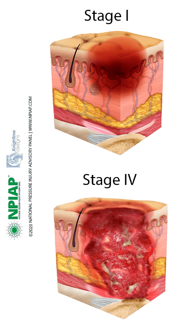{width="100%"}
::::

:::: {.column width="35%"}
::: {.r-stack}
::: {.fragment .fade-out fragment-index=1}
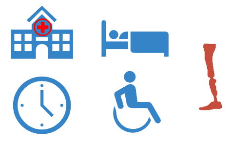{width="100%"}
:::

::: {.fragment .fade-up fragment-index=1}
::::: {.data-card .blue-card}
<div class="card-big-text">1 in 5</div>
European hospital patients
<span class="card-ref">[@vanderwee2007]</span>
:::::
:::
:::
::::

:::: {.column width="35%"}
::: {.fragment .fade-up fragment-index=2}
::::: {.data-card .red-card}
<div class="card-big-text">50%</div>
Incidence worldwide
<span class="card-ref">[@lyder2008]</span>
:::::
:::
::::

:::

## A Life-Threatening Reality 

::: {.slide-subtitle-area}
Pressure ulcers are not just "sores." They are systemic failures.
:::

::: {.columns .v-center .mt-100}

::: {.column width="33%"}
::: {.info-card}
<iconify-icon icon="mdi:flash-alert-outline" class="card-icon"></iconify-icon>

### Painful

- Massive, chronic pain
- Severely reduced independence
:::
:::

::: {.column width="33%"}
::: {.fragment .fade-up}
::: {.info-card}


### Isolating

- Extremely long healing
- Long term hospitalization
- Limited interactions
:::
:::
:::

::: {.column width="33%"}
::: {.fragment .fade-up}
::: {.info-card}
<iconify-icon icon="mdi:skull-outline" class="card-icon"></iconify-icon>

### Consequences

- Risk of amputation
- High mortality rates
- Massive healthcare costs
:::
:::
:::

:::

## The "Guilty" Factors: Etiology of Ulcers 

::: {.columns .v-center .mt-40}

:::: {.column width="25%"}
{width="100%"}
::::

::: {.column width="70%"}

::: {.fragment .fade-left}
::: {.etiology-long-card}
<div class="etiology-card-icon">
  
</div>
<div class="etiology-card-content">
  <div class="etiology-card-title">External Forces</div>
  <p class="etiology-card-text">Prolonged mechanical loading structurally compresses the tissue architecture.</p>
</div>
:::
:::

::: {.fragment .fade-left}
::: {.etiology-long-card}
<div class="etiology-card-icon">
  
</div>
<div class="etiology-card-content">
  <div class="etiology-card-title">Oxygen Deprivation</div>
  <p class="etiology-card-text">Pinched blood supply leads to severe ischemia and a toxic lack of oxygen.</p>
</div>
:::
:::

::: {.fragment .fade-left}
::: {.etiology-long-card}
<div class="etiology-card-icon">
  
</div>
<div class="etiology-card-content">
  <div class="etiology-card-title">State of the Tissue</div>
  <p class="etiology-card-text">Patient-specific vulnerability and inherent stiffness determine the overall biological tolerance.</p>
</div>
:::
:::

:::
:::

## The Clinician's Dilemma

::: {.columns}
::: {.column width="50%"}
<br>
<br>

**What would you do?**

You are the attending doctor or nurse. 
<br>

You have a bedridden patient in front of you.
<br> 

Your absolute priority is to prevent their tissue from breaking down and forming an ulcer. 

:::
::: {.column width="40%"}
<br>
<br>

:::

::: {.column style="position: absolute; right: -15%; top: -15%; height: 130%; width: 55%; background-image: url('../../../../resources/images/clinician_patient.png'); background-size: cover; background-position: center; z-index: -1;"}
:::
:::

::: {.fragment .fade-up style="margin-top: 150px;"}
::: {.warning-box}
<div class="warning-icon"><iconify-icon icon="mdi:clock-alert-outline"></iconify-icon></div>
<div class="warning-content">
  The biological clock starts ticking for THIS specific patient.<br>
  <b>But how fast?</b>
</div>
:::
:::


## The Illusion of Control
::: {.slide-subtitle-area}
Clinical Scoring
:::

::: {.columns .v-center .mt-20}

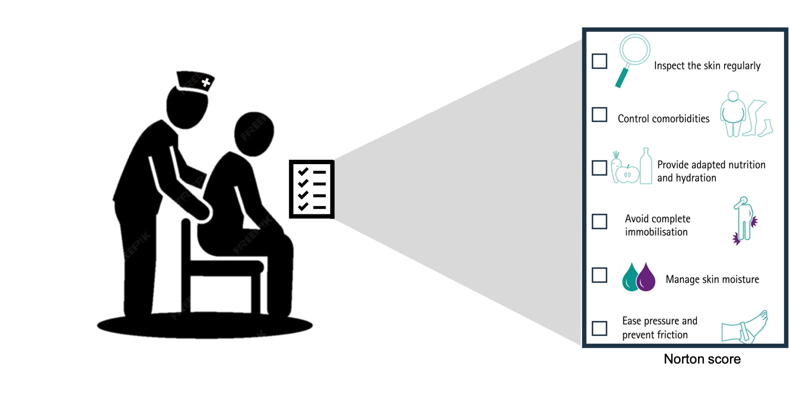{width="90%"}

::: {.notes}
::: {.norton-box}
<div class="norton-title">Norton score</div>

- [ ] Inspect the skin regularly
- [ ] Control comorbidities
- [ ] Provide adapted nutrition and hydration
- [ ] Avoid complete immobilisation
- [ ] Manage skin moisture
- [ ] Ease pressure and prevent friction
:::


Today, medical staff rely on two main tools to prevent pressure ulcers. While useful, they provide a false sense of security.
1. Clinical Scoring (Norton Score): Questionnaires to assess general risk factors (mobility, nutrition, moisture).
2. Pressure Maps: Sensor mats placed on the bed or wheelchair to monitor static compression areas.
We might think the problem is under control. But it is not.
:::
:::


## The Illusion of Control
::: {.slide-subtitle-area}
Pressure Maps
:::

::: {.r-stack}
::: {.columns .v-center .w-100}
::: {.column width="35%"}
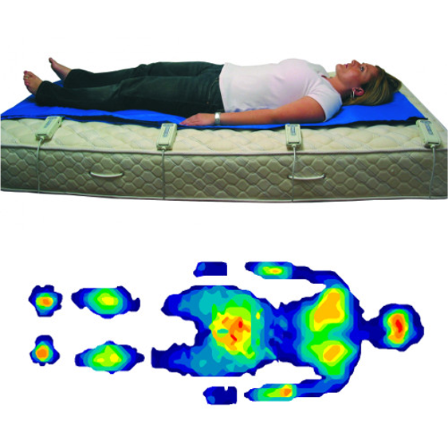{width="80%"}
:::

::: {.column width="75%"}
::: {.columns .v-center}
::: {.column .w-50 .h-center}
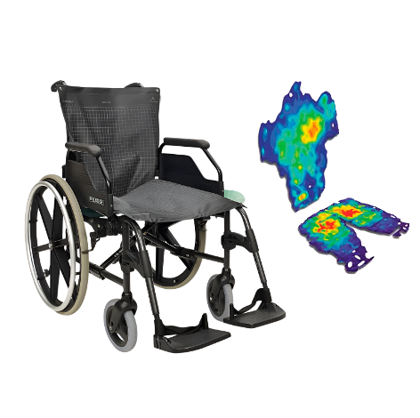{width="50%" .h-center}
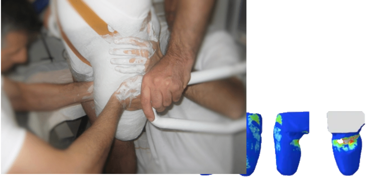{width="50%" .mt-20 .h-center}
:::
::: {.column width="25%"}
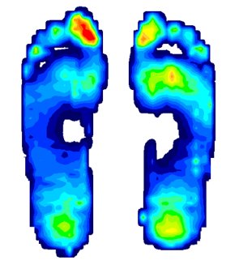{width="75%"}
:::
:::
:::

:::

::: {.fragment .fade-up}
::: {.takeaway-overlay}
::: {.takeaway-card}
Help for medical device **design**.

But completely **non-ecological** for permanent, real-time clinical monitoring.
:::
:::
:::
:::

:::{.notes}
Today, medical staff rely on two main tools to prevent pressure ulcers. While useful, they provide a false sense of security.
1. Clinical Scoring (Norton Score): Questionnaires to assess general risk factors (mobility, nutrition, moisture).
2. Pressure Maps: Sensor mats placed on the bed or wheelchair to monitor static compression areas.
We might think the problem is under control. But it is not.
:::


## The Diagnostic Dead End

::: {.flex-center .w-100 .gap-80 .mt-60}

::: {.deadend-card }
<div class="deadend-icon-wrapper red-bg">
  <iconify-icon icon="mdi:eye-off-outline"></iconify-icon>
</div>

<div class="deadend-title red-text">Diagnostic <br>Blind Spot</div>

<ul class="deadend-list">
  <li>External Sensors and Evaluation.</li>
  <li>**No measurement of microcirculation.**</li>
  <li>Imaging and Biopsies are limited to static monitoring.</li>
</ul>
:::

::: {.deadend-card .fragment .fade-up}
<div class="deadend-icon-wrapper blue-bg">
  
</div>

<div class="deadend-title blue-text">Extreme Patient Variability</div>

::: {.colored-bullets}
- Ageing effect.
- Comorbidities.
- No universal clinical and mechanical evaluation.
:::
:::

:::

## The Material Twin Bridge

::::::: {.bridge-container .neg-mt-40}

:::::: {.bridge-main-area}

::::: {.label-box .left-label}
Real World
:::::

::::: {.bridge-visual-wrapper}

:::: {.warning-wrapper .fragment .fade-in fragment-index=4}
{width="130px"}
::::

{.bridge-svg}

:::::

::::: {.label-box .right-label}
Analytics and Modelling
:::::

::::::

:::::: {.action-grid}

::::: {.action-card .fragment .fade-up fragment-index=1}
{.action-icon}
<div class="action-text">Experiment</div>
:::::

::::: {.action-card .fragment .fade-up fragment-index=2}
{.action-icon}
<div class="action-text">Assumption Model</div>
:::::

::::: {.action-card .fragment .fade-up fragment-index=3}
{.action-icon}
<div class="action-text">Compute Analyse</div>
:::::

::::::

:::::::

## The Modelling Challenge
::: {.slide-subtitle-area}
Limited access to data &Rightarrow; Comprehensive modeling.
:::

::: {.modelling-row}

::: {.model-step .fragment .fade-in fragment-index=1}
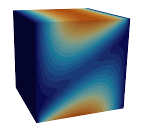{.model-img}
:::

::: {.model-step .fragment .fade-in fragment-index=3}
<iconify-icon icon="mdi:arrow-right-thick" class="model-arrow"></iconify-icon>
{.model-img}
<iconify-icon icon="mdi:arrow-right-thick" class="model-arrow"></iconify-icon>
:::

::: {.model-step .fragment .fade-in fragment-index=2}
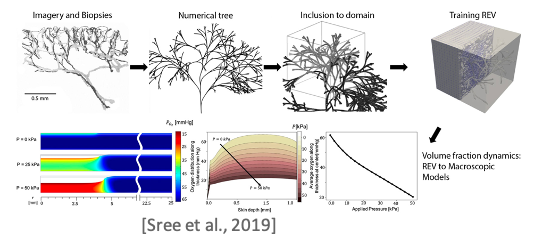{.model-img}
<iconify-icon icon="mdi:arrow-right-thick" class="model-arrow"></iconify-icon>
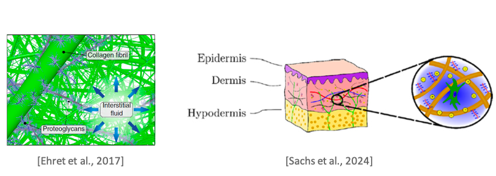{.model-img}
:::

:::

::: {.columns .mt-50}
::: {.column .w-45 .fragment fragment-index=1}
::: {.eval-card .eval-card-short}
<h3 class="text-red mt-0">Over simplified models</h3>
<ul class="eval-list text-lg">
  <li class="cross">Ignores structural complexity</li>
  <li class="cross">Lacks patient specificity</li>
</ul>
:::
:::
::: {.column .w-45 .fragment fragment-index=2}
::: {.eval-card .eval-card-short}
<h3 class="text-red mt-0">Over complexified models</h3>
<ul class="eval-list text-lg">
  <li class="cross">Computationally heavy</li>
  <li class="cross">Too many unknown parameters</li>
</ul>
:::
:::
:::

::: {.fragment .fade-up fragment-index=3 .mt-0}
::: {.takeaway-card .w-90 .mt-20 .h-center .text-xl .text-left style="padding: 10px 20px;"}
<ul class="colored-bullets" style="margin-top: 0; margin-bottom: 0;">
  <li>Few multi-physics in vivo studies have been evaluated for skin.</li>
  <li>Access to Inter- and Intra- individual variations is crucial.</li>
  <li>Allow for dynamic update (remodeling).</li>
</ul>
:::
:::

## Data Assimilation: The Weather Forecast Analogy

::: {.text-center .mt-60}
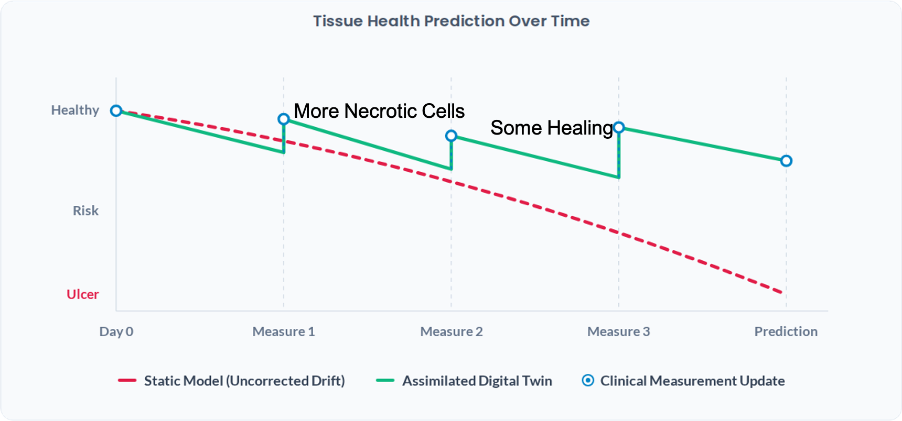{width="85%" .shadow-img}
:::


## The Solution: Dynamic Digital Physical Twins

::: {.columns style="align-items: stretch; justify-content: space-around;"}

::: {.column .w-45 .mt-100}
::: {.eval-card .eval-card-tall style="height: 100%;"}
<div class="action-icon"><iconify-icon icon="mdi:database-sync-outline" class="icon-title-large"></iconify-icon></div>
<h3 class="mb-30">Data Assimilation</h3>
<ul class="eval-list text-lg lh-14">
  <li class="mb-20"><b>Baseline:</b> Patient-specific anatomy & mechanics.</li>
  <li class="mb-20"><b>Updates:</b> Periodic real-world evaluations.</li>
  <li class="mb-20"><b>Goal:</b> Prevent model divergence | Assess individual parameters.</li>
</ul>
:::
:::

::: {.column .w-45 .mt-100}
::: {.eval-card .eval-card-tall .fragment .fade-up style="height: 100%;"}
<div class="action-icon"><iconify-icon icon="mdi:heart-pulse" class="icon-title-large"></iconify-icon></div>
<h3 class="mb-30">Biomechanical Simulation</h3>
<ul class="eval-list text-lg lh-14">
  <li class="mb-20"><b>Dynamics:</b> Simulates tissue response over hours/days.</li>
  <li class="mb-20"><b>Precision:</b> Pinpoints the exact location of ischemia.</li>
  <li class="mb-20"><b>Action:</b> Predicts collapse before it happens.<br><br></li>
</ul>
:::
:::

:::


## Back to Physics: Skin as a Sponge

::: {.columns .v-center .mt-40}
::: {.column .w-45}
::: {.info-card .info-card-auto .mb-0 .shadow-none} 
<ul class="text-2xl">
  <li>Solid Scaffold & Cells</li>
  <li>Interstitial Fluid</li>
  <li>Blood & Oxygen</li>
</ul>
:::

::: {.fragment fragment-index=1}
::: {.eval-card .info-card-auto .text-left .neg-mt-40} 
<ul style="list-style: none; padding: 0; margin: 0;" class="text-xl lh-15">
  <li><iconify-icon icon="mdi:arrow-collapse-all" class="text-red"></iconify-icon> <b>Squeeze</b> &rightarrow; Fluid forced out</li>
  <li><iconify-icon icon="mdi:pause-octagon" class="text-red"></iconify-icon> <b>Hold</b> &rightarrow; Fluid still moves</li>
  <li><iconify-icon icon="mdi:arrow-expand-all" class="text-red"></iconify-icon> <b>Release</b> &rightarrow; Fluid rushes back</li>
</ul>
:::
:::
:::

::: {.column .w-55}
::: {.r-stack}
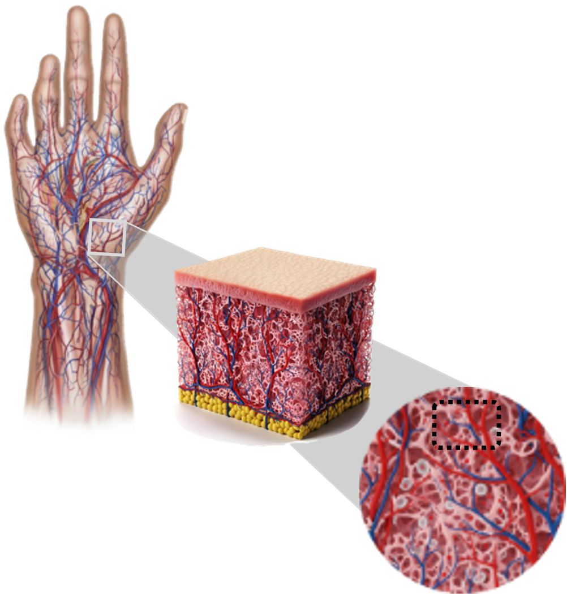{.fragment .fade-out .w-60 .h-center fragment-index=1 .shadow-none}

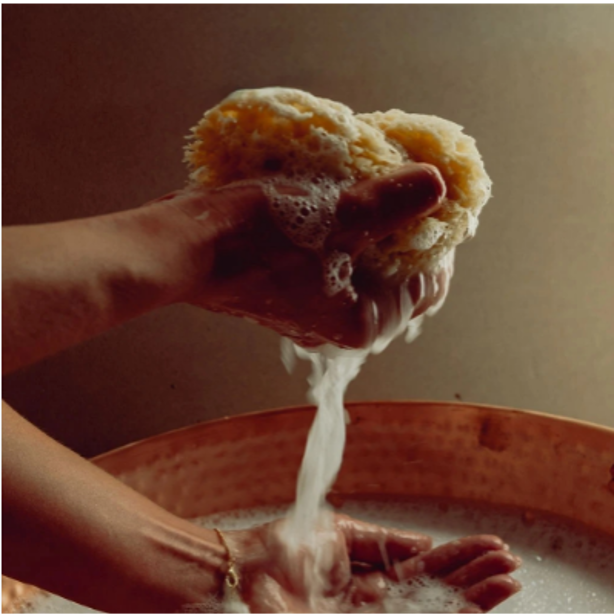{.fragment .fade-up .w-100 .shadow-img .h-center fragment-index=1}
:::
:::
:::


## Bridging the gap

::: {.columns .v-center .gap-30 .mt-150}

::: {.column width="30%"}
::: {.eval-card}
<div class="action-icon"><iconify-icon icon="mdi:cube-outline" class="icon-title-large"></iconify-icon></div>
<h3 class="text-2xl mb-30">Mechanical Models</h3>
<ul class="eval-list text-lg">
  <li class="check">Captures stiffness, creep & relaxation.</li>
  <li class="cross">Ignores blood entirely.</li>
</ul>
:::
:::

::: {.column width="30%"}
::: {.fragment .fade-up}
::: {.eval-card}
<div class="action-icon"><iconify-icon icon="mdi:water-outline" class="icon-title-large"></iconify-icon></div>
<h3 class="text-2xl mb-30">Vascular Models</h3>
<ul class="eval-list text-lg">
  <li class="check">High biological detail.</li>
  <li class="cross">Computationally impossible at scale.</li>
</ul>
:::
:::
:::

::: {.column width="30%"}
::: {.fragment .fade-up}
::: {.eval-card style="border-top-color: var(--card-red); box-shadow: 0 15px 35px rgba(211,54,42,0.15);"}
<div class="action-icon"><iconify-icon icon="mdi:layers-outline" class="text-red icon-title-large"></iconify-icon></div>
<h3 class="text-red text-2xl mb-30">Poromechanics</h3>
<ul class="eval-list text-lg">
  <li class="check">Analytical coupling of mechanics and microcirculation.</li>
  <li class="check">Average theory at organ scale.</li>
</ul>
:::
:::
:::

:::


## Bi-Compartment Porous Model

::: {.columns .v-center .mt-150}

::: {.column .w-45 .neg-mt-60}
::: {.r-stack}
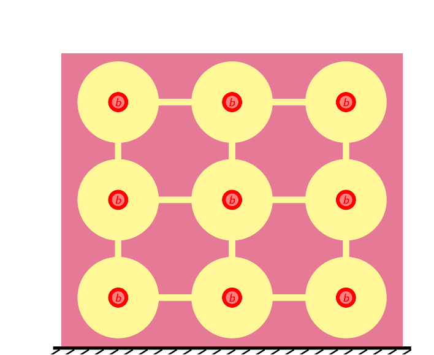{.w-100 .shadow-none .h-center}

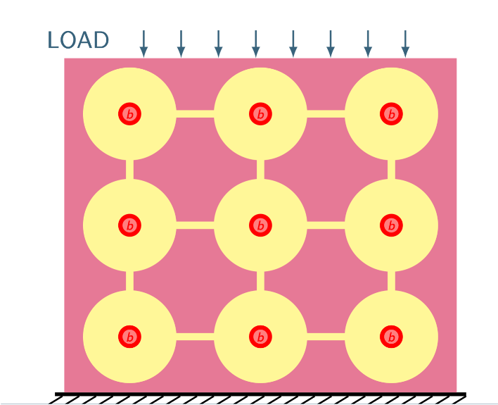{.fragment .strike-up .w-100 .shadow-none .h-center fragment-index=1}

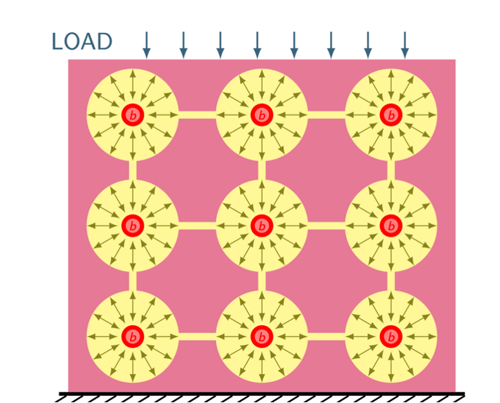{.fragment .strike-up .w-100 .shadow-none .h-center fragment-index=2}
:::
:::

::: {.column .w-45}
::: {.info-card .info-card-auto}
<h3 class="text-4xl mb-40">How does it work?</h3>
<div class="text-center text-xl lh-15 text-title">
  Increasing force on the solid<br>
  <iconify-icon icon="mdi:arrow-down-thick" class="icon-red-md"></iconify-icon><br>
  Increased pressure in the pores<br>
  <iconify-icon icon="mdi:arrow-down-thick" class="icon-red-md"></iconify-icon><br>
  <b>Squeezed blood vessels</b>
</div>
:::
:::
:::

::: {.citation-footer .alt-bottom}
**[@Lavigne2023]**
:::

::: {.fragment .fade-up}
::: {.takeaway-overlay .neg-mt-150}
::: {.takeaway-card .neg-mt-80}
Allows for direct integration of **biological exchanges** and 
cell dynamic **death/healing** rates.
:::
:::
:::

## Challenging the Model

::: {.mt-20}
::: {.r-stack}
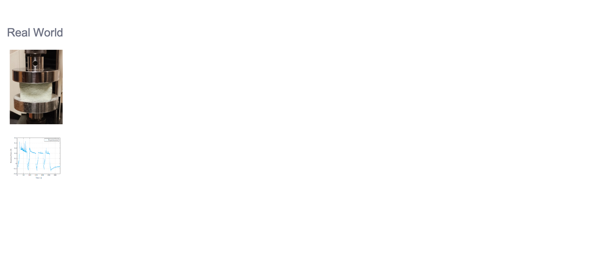{.fragment .strike-in .w-100 .shadow-none .h-center fragment-index=1}

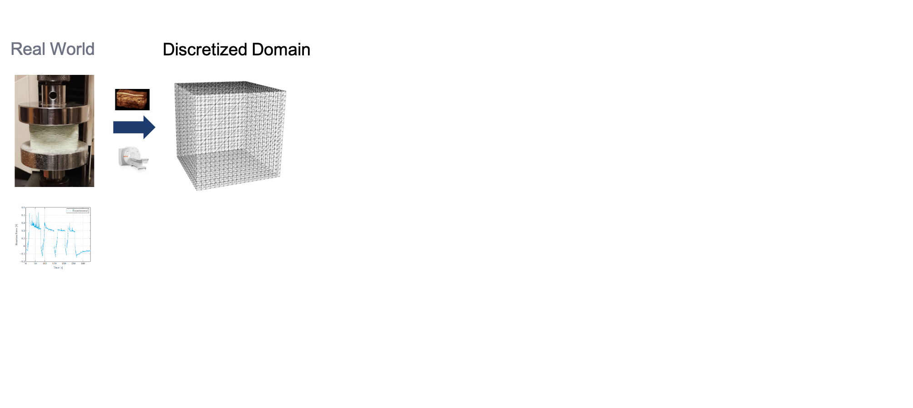{.fragment .strike-in .w-100 .shadow-none .h-center fragment-index=2}

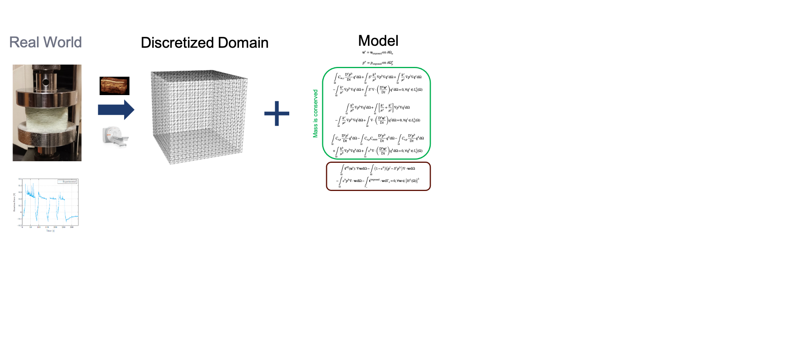{.fragment .strike-in .w-100 .shadow-none .h-center fragment-index=3}

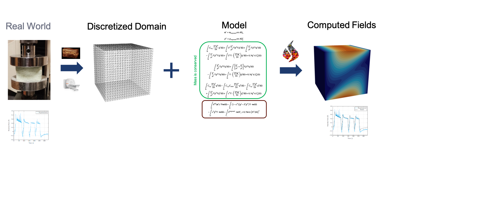{.fragment .strike-in .w-100 .shadow-none .h-center fragment-index=4}

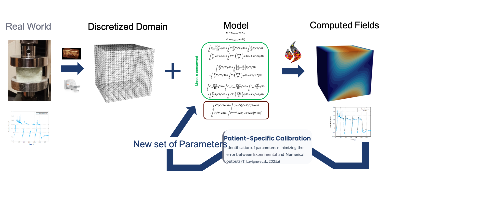{.fragment .strike-in .w-100 .shadow-none .h-center fragment-index=5}

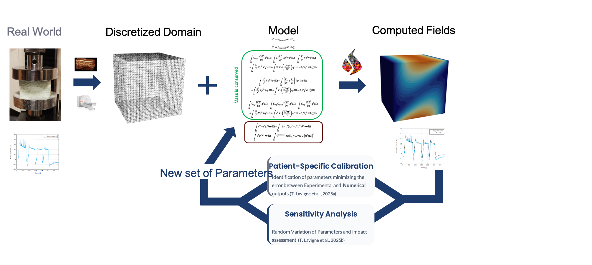{.fragment .strike-in .w-100 .shadow-none .h-center fragment-index=6}

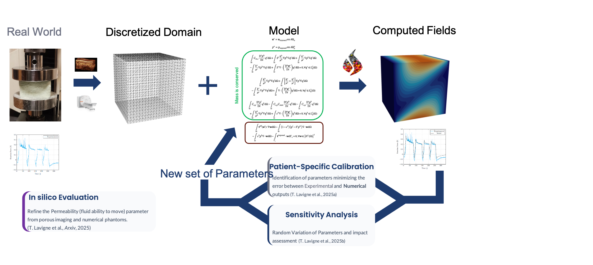{.fragment .strike-in .w-100 .shadow-none .h-center fragment-index=7}

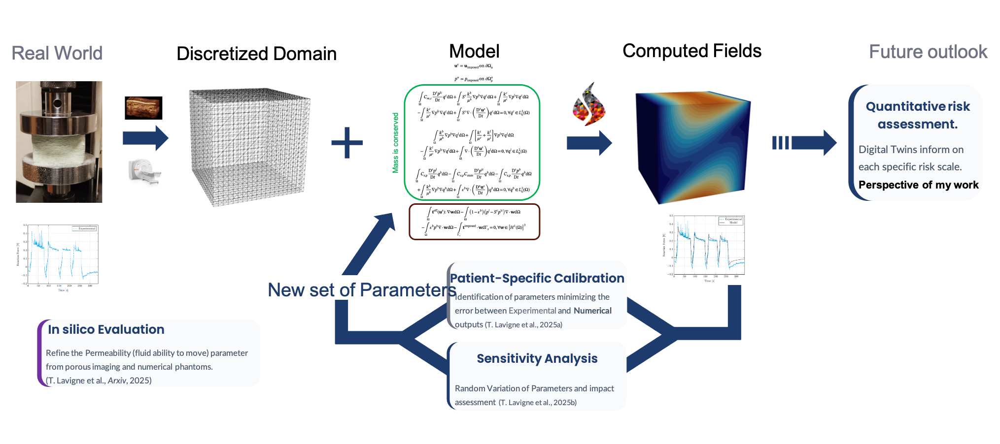{.fragment .strike-in .w-100 .shadow-none .h-center fragment-index=8}
:::
:::

::: {.citation-footer}
**[@Lavigne2022,@Lavigne2023,@Lavigne2024,@Lavigne2025b,@lavigne2025synthetic]**
:::


## In Vivo Evaluation: Hold phase

::::: {.columns .v-center .mt-20}

:::: {.column style="width:15%;" .flex-col .gap-20}
::: {.info-card .info-card-auto .text-center style="box-shadow: none !important;"}
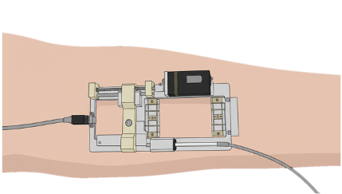{width="70%" .shadow-img}
<p class="mt-20" style="color: #666;"><b>Unloaded</b></p>
:::

::: {.info-card .info-card-auto .text-center .fragment .fade-in fragment-index=1 style="box-shadow: none !important;"}
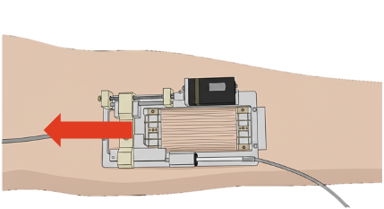{width="70%" .shadow-img}
<p class="mt-20" style="color: #666;"><b>Loaded</b></p>
:::
::::

:::: {.column width="65%"}

```{python}
#| echo: false
import plotly.graph_objects as go
import numpy as np
import pandas as pd
from IPython.display import display, HTML
import html as html_lib

# 1. Chargement des données
try:
    df_exp = pd.read_csv('../../resources/csv/RF_exp_.csv')
    t_exp, rf_exp = df_exp['t'], df_exp['rf']
except FileNotFoundError:
    t_exp = np.linspace(0, 340, 500)
    rf_exp = 0.4 * np.exp(-t_exp/50) + 0.05 * np.random.normal(0, 0.1, 500)

try:
    df_mod = pd.read_csv('../../resources/csv/RF_HE.csv')
    t_mod, rf_mod = df_mod['a'], df_mod['b']
except FileNotFoundError:
    t_mod = np.linspace(0, 340, 500)
    rf_mod = 0.4 * np.exp(-t_mod/55)

# 2. Configuration du Layout
base_layout = go.Layout(
    xaxis=dict(title="Time (s)", range=[0, 340], gridcolor='rgba(200,200,200,0.5)', griddash='dash', zeroline=False),
    yaxis=dict(title="Reaction Force (N)", range=[-0.2, 0.5], gridcolor='rgba(200,200,200,0.5)', griddash='dash', zeroline=False),
    plot_bgcolor='rgba(0,0,0,0)', 
    paper_bgcolor='rgba(0,0,0,0)',
    legend=dict(yanchor="top", y=0.99, xanchor="right", x=0.99, bgcolor='rgba(255,255,255,0.7)', font=dict(size=28)),
    margin=dict(l=10, r=10, t=10, b=10),
    height=400,
    width=600,
    font=dict(size=22)
)

trace_exp = go.Scatter(x=t_exp, y=rf_exp, mode='lines', line=dict(color='rgb(145, 178, 255)', dash='dash', width=3), name='Experimental')
trace_mod = go.Scatter(x=t_mod, y=rf_mod, mode='lines', line=dict(color='black', width=3), name='Model')

# --- Création des Figures ---
fig1 = go.Figure(layout=base_layout)
fig1.add_trace(trace_exp)

fig2 = go.Figure(layout=base_layout)
fig2.add_trace(trace_exp)
fig2.add_trace(trace_mod)

# --- Conversion en IFRAME pour compatibilité Chalkboard ---
# On génère du HTML complet pour chaque graphique
raw_html1 = fig1.to_html(full_html=True, include_plotlyjs='cdn', config={'displayModeBar': False})
raw_html2 = fig2.to_html(full_html=True, include_plotlyjs='cdn', config={'displayModeBar': True, 'scrollZoom': True})

# On escape le HTML pour l'insérer dans l'attribut srcdoc
iframe1 = f'<iframe srcdoc="{html_lib.escape(raw_html1)}" style="width:650px; height:450px; border:none;"></iframe>'
iframe2 = f'<iframe srcdoc="{html_lib.escape(raw_html2)}" style="width:650px; height:450px; border:none;"></iframe>'

# Affichage sécurisé dans le r-stack
display(HTML(f'''
<div class="r-stack">
    <div class="fragment fade-in-then-out" data-fragment-index="2" style="width:100%;">
        {iframe1}
    </div>
    <div class="fragment fade-in" data-fragment-index="3" style="width:100%;">
        {iframe2}
    </div>
</div>
'''))
```

::::

:::::

::: {.fragment .fade-up data-fragment-index="4" style="position: relative; margin-top: -150px; z-index: 10;"}
::: {.takeaway-overlay .neg-mt-150}
::: {.takeaway-card .neg-mt-80 .text-xl}
<ul class="colored-bullets" style="margin: 0; padding-left: 20px;">
  <li><b>Physics matches reality:</b> High correlation during the relaxation phase.</li>
  <li><b>Patient Specific:</b> Properties derived from individual indentation curves.</li>
  <li><b>Poromechanics:</b> Captures the fluid flow time-constants better than viscoelasticity.</li>
</ul>
:::
:::
:::


::: {.citation-footer}
**[@Lavigne2024]**
:::

::: {.logo-footer-right}
{height="70px"}
:::


## In Vivo Evaluation: Perfusion vs Mechanics
::: {.slide-subtitle-area}
Ethical approval (national registration number RCB: 2023-­ A00418-­ 37)
:::


::: {.columns .v-center}

::: {.column width="40%"}
::: {.info-card .info-card-auto .neg-mt-150}
<ul class="colored-bullets text-2xl lh-15" style="margin: 0;">
  <li><b>11 Human Volunteers</b></li>
  <li>Gender-Inclusive Cohort</li>
  <li>Controlled Finger Indentation</li>
  <li>Real-Time LDF Blood Flux</li>
</ul>
:::
:::

::: {.column width="60%"}
::: {.r-stack}
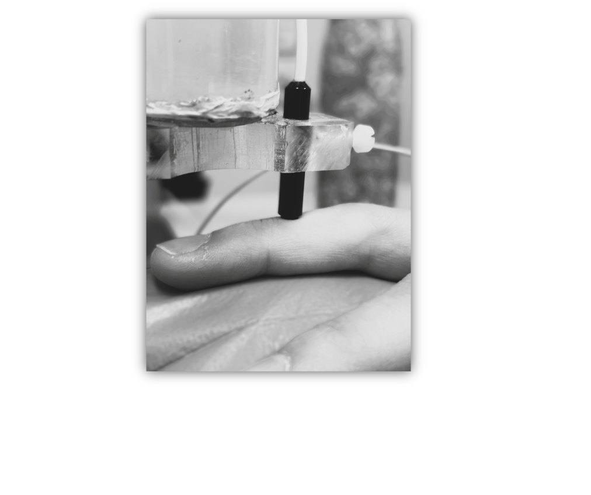{.fragment .current-visible .w-100 .shadow-none .h-center fragment-index=1}

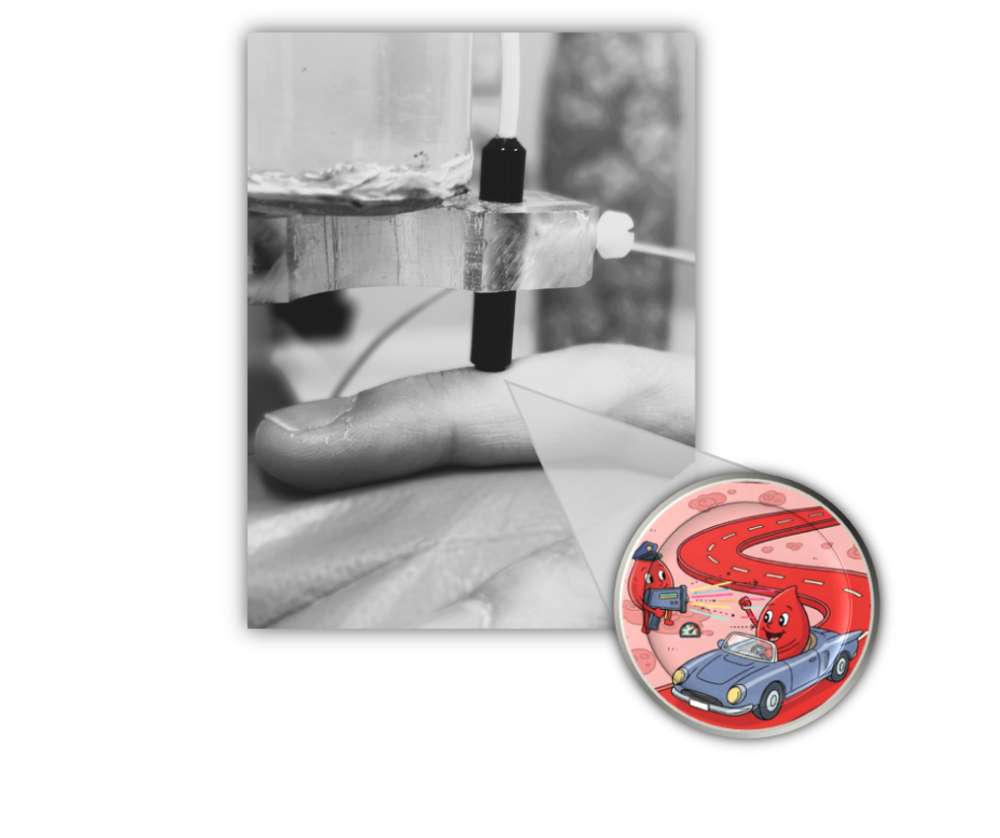{.fragment .current-visible .w-100 .shadow-none .h-center fragment-index=2}
:::
:::

:::

::: {.citation-footer}
**[@Lavigne2025b]**
:::

::: {.logo-footer-right}
{height="70px"}
:::


## In Vivo Evaluation: Perfusion vs Mechanics
::: {.slide-subtitle-area}
Ethical approval (national registration number RCB: 2023-­ A00418-­ 37)
:::

::: {.text-center .mt-20 style="position: relative;"}
::: {.r-stack}
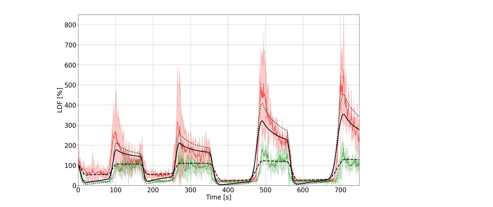{.w-100 .shadow-none .h-center}

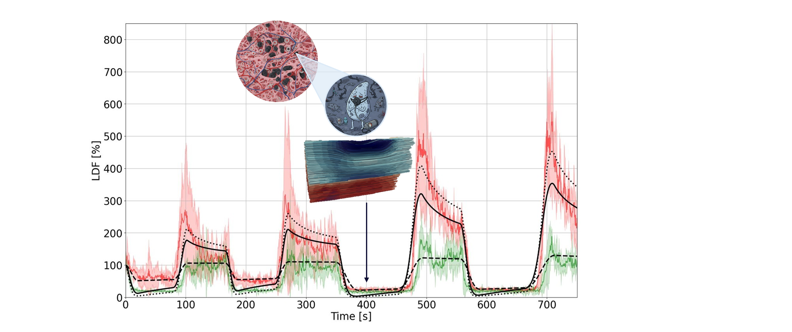{.fragment .current-visible .w-100 .shadow-none .h-center fragment-index=1}

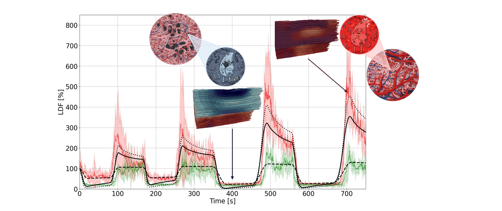{.fragment .current-visible .w-100 .shadow-none .h-center fragment-index=2}
:::

::: {.fragment .fade-up fragment-index=3}
::: {.takeaway-card .w-60 style="position: absolute; bottom: 20px; left: 50%; transform: translateX(-50%); min-width: auto; padding: 20px; box-shadow: 0 15px 40px rgba(0,0,0,0.2); border: 4px solid var(--success-green);"}
<h3 class="mb-15 font-bold" style="color: var(--success-green); font-size: 40pt; margin-top: 0;">LDF</h3>
<b>Real-Time Evaluation</b><br>
<span class="text-lg" style="color: #555;">Model accurately reproduces ischemic drops and hyperemic overshoots.</span>
:::
:::
:::

::: {.citation-footer}
**[@Lavigne2025b]**
:::

::: {.logo-footer-right}
{height="70px"}
:::


## Impact & Open Science

::: {.flex-center .gap-40 .mt-50}

::: {.column width="40%"}
::: {.info-card .eval-card-tall}
<iconify-icon icon="mdi:file-document-multiple-outline" class="icon-title-large text-red"></iconify-icon>
<h3 class="mb-20 text-red">Output</h3>
<ul class="colored-bullets text-lg lh-15 text-left">
  <li>6 Journal Articles</li>
  <li>2025 Excellent Thesis Award</li>
  <li>Best Poster (2nd), PhD Day '24</li>
</ul>
:::
:::

::: {.column width="40%"}
::: {.info-card .eval-card-tall}
<iconify-icon icon="mdi:github" class="icon-title-large"></iconify-icon>
<h3 class="mb-20">Open Source</h3>
<ul class="text-lg lh-15 text-left" style="color: #4B5563;">
  <li>FEniCSx & GitHub</li>
  <li>Inria: "Reproducible Research"</li>
  <li>Anonymised and available data</li>
</ul>
:::
:::

:::

::: {.fragment .fade-up .text-center .mt-20}
::: {.takeaway-card .w-85 .h-center .text-xl style="min-width: auto; padding: 25px; border-color: var(--title-color);"}
**An openly available comprehensive and evaluated toolbox to go towards patient-specific pressure ulcer risk assessment and digital twins.**
:::
:::


## Invited Talks and Conferences, and global Collabs.

::: {.text-center .mt-50}
```{python}
#| echo: false
import folium
import branca
from IPython.display import display

# Define precise dimensions (adjust based on your slide content)
# Width can be a percentage or pixels; height is best in pixels for Reveal.js
width = "95%"
height = 700 

# Create a Figure to hold the map with fixed dimensions
fig = branca.element.Figure(width=width, height=height)

# Create the map
m = folium.Map(
    location=[48, 10], 
    zoom_start=5, 
    attr='&copy; OpenStreetMap',
    zoom_control=True
)

# 1. Laboratoires et Éducation (Marqueurs standards)
labs = [
    {"name": "LMS, Polytechnique (Palaiseau/Paris)", "coords": [48.7135, 2.2105], "type": "Post-Doc Current"},
    {"name": "IBHGC, ENSAM (Paris)", "coords": [48.8315, 2.3610], "type": "PhD (Co-tutelle) / Internship"},
    {"name": "I2M (Bordeaux)", "coords": [44.8378, -0.5792], "type": "Post-Doc / PhD (Co-tutelle) / Internship"},
    {"name": "University of Luxembourg", "coords": [49.5042, 5.9479], "type": "PhD (Co-tutelle) / Internship"},
    {"name": "ENS Paris-Saclay", "coords": [48.7126, 2.1663], "type": "Education"},
    {"name": "IMT Atlantique (Rennes)", "coords": [48.1173, -1.6778], "type": "Collab (Brain)"},
    {"name": "LBTI (Lyon)", "coords": [45.7795, 4.8750], "type": "Collab (Skin Biology)"},
    {"name": "FEMTO-ST (Besançon)", "coords": [47.2500, 5.9900], "type": "Collab (Skin Experiments)"},
    {"name": "FAU Erlangen-Nuremberg", "coords": [49.5978, 11.0037], "type": "Visiting"},
    {"name": "University of Leeds", "coords": [53.8067, -1.5550], "type": "Collab (Breast)"},
    {"name": "Euler Institute (Lugano, Suisse)", "coords": [46.0037, 8.9511], "type": "Collab (Porous media)"},
    {"name": "Bucknell University (PA, USA)", "coords": [40.9548, -76.8814], "type": "Collab (Muscle modelling)"}
]

for lab in labs:
    folium.Marker(
        location=lab["coords"],
        popup=folium.Popup(f"<b>{lab['name']}</b><br>{lab['type']}", max_width=300),
        icon=folium.Icon(color='blue', icon='info-sign')
    ).add_to(m)

# 2. Conférences (Points Rouges)
conferences = [
    {"name": "WCB 2022 (Taipei)", "coords": [25.0330, 121.5654], "date": "2022"},
    {"name": "Euromech 670 (Rennes)", "coords": [48.1173, -1.6778], "date": "2026"},
    {"name": "EPUAP (Lausanne)", "coords": [46.5197, 6.6323], "date": "2024"},
    {"name": "Interpore BeneLux (Esch)", "coords": [49.4967, 5.9522], "date": "2024"},
    {"name": "BSSM (Glasgow)", "coords": [55.8642, -4.2518], "date": "2023"},
    {"name": "CMBBE / SB (Paris/St-Etienne)", "coords": [48.8566, 2.3522], "date": "2021-2023"},
    {"name": "FEniCSx Symposium (Talence)", "coords": [44.8066, -0.5891], "date": "2024"}
]

for conf in conferences:
    folium.CircleMarker(
        location=conf["coords"],
        radius=7,
        color='#E84C3D',
        fill=True,
        fill_color='#E84C3D',
        fill_opacity=0.8,
        popup=folium.Popup(f"<b>{conf['name']}</b><br>Congrès/Symposium {conf['date']}", max_width=300)
    ).add_to(m)

# Add the map to the Figure and render the Figure
fig.add_child(m)
display(fig)
```

:::

## Curriculum Vitae

```{=html}
<div class="cv-container">

  <div class="cv-item">
    <div class="cv-left">
      <div class="cv-date">2016 – 2018</div>
    </div>
    <div class="cv-center">
      <div class="cv-dot"></div><div class="cv-line"></div>
    </div>
    <div class="cv-right">
      <div class="cv-title">Classes Préparatoires (PCSI/PSI*)</div>
      <div class="cv-subtitle">Lycée Hoche, Versailles</div>
    </div>
    <div class="cv-logos">
      
    </div>
  </div>

  <div class="cv-item">
    <div class="cv-left">
      <div class="cv-date">2018 – 2020</div>
      <div class="cv-icons">
        <iconify-icon icon="mdi:file-document-outline"></iconify-icon>
      </div>
    </div>
    <div class="cv-center">
      <div class="cv-dot"></div><div class="cv-line"></div>
    </div>
    <div class="cv-right">
      <div class="cv-title">M1 & Bachelor's in Mechanical Engineering</div>
      <div class="cv-subtitle">ENS Paris-Saclay</div>
    </div>
    <div class="cv-logos">
      
    </div>
  </div>

  <div class="cv-item">
    <div class="cv-left">
      <div class="cv-date">2020 – 2021</div>
      <div class="cv-icons">
        <iconify-icon icon="mdi:file-document-outline"></iconify-icon>
      </div>
    </div>
    <div class="cv-center">
      <div class="cv-dot"></div><div class="cv-line"></div>
    </div>
    <div class="cv-right">
      <div class="cv-title">MSc in Biomechanics</div>
      <div class="cv-subtitle">ENSAM Paris</div>
    </div>
    <div class="cv-logos">
      
    </div>
  </div>

  <div class="cv-item">
    <div class="cv-left">
      <div class="cv-date">2021 – 2022</div>
      <div class="cv-icons">
        <iconify-icon icon="mdi:file-document-outline"></iconify-icon>
        <iconify-icon icon="mdi:file-document-outline"></iconify-icon>
      </div>
    </div>
    <div class="cv-center">
      <div class="cv-dot"></div><div class="cv-line"></div>
    </div>
    <div class="cv-right">
      <div class="cv-title">Pre-Doctoral Research Year</div>
      <div class="cv-subtitle">Univ. Luxembourg / ENS Paris-Saclay</div>
    </div>
    <div class="cv-logos">
      
    </div>
  </div>

  <div class="cv-item">
    <div class="cv-left">
      <div class="cv-date">2022 – 2025</div>
      <div class="cv-icons">
        <iconify-icon icon="mdi:file-document-outline"></iconify-icon>
        <iconify-icon icon="mdi:file-document-outline"></iconify-icon>
        <iconify-icon icon="mdi:file-document-outline"></iconify-icon>
        <iconify-icon icon="mdi:file-document-outline"></iconify-icon>
      </div>
    </div>
    <div class="cv-center">
      <div class="cv-dot"></div><div class="cv-line"></div>
    </div>
    <div class="cv-right">
      <div class="cv-title">PhD in Engineering Sciences (Biomechanics)</div>
      <div class="cv-subtitle">Univ. Luxembourg / ENSAM / I2M · AFR-FNR</div>
    </div>
    <div class="cv-logos">
      
      
      
    </div>
  </div>

  <div class="cv-item">
    <div class="cv-left">
      <div class="cv-date">2025 – 2025</div>
      <div class="cv-icons">
        <iconify-icon icon="mdi:file-document-outline"></iconify-icon>
      </div>
    </div>
    <div class="cv-center">
      <div class="cv-dot"></div><div class="cv-line"></div>
    </div>
    <div class="cv-right">
      <div class="cv-title">Post-Doctoral Researcher</div>
      <div class="cv-subtitle">Univ. Bordeaux, I2M</div>
    </div>
    <div class="cv-logos">
      
    </div>
  </div>

  <div class="cv-item">
    <div class="cv-left">
      <div class="cv-date current">2025 – 2027</div>
      <div class="cv-icons">
        <iconify-icon icon="mdi:file-document-outline"></iconify-icon>
      </div>
    </div>
    <div class="cv-center">
      <div class="cv-dot current"></div><div class="cv-line"></div>
    </div>
    <div class="cv-right">
      <div class="cv-title">Post-Doctoral Researcher</div>
      <div class="cv-subtitle">École Polytechnique, CNRS, ANR ROSALY</div>
    </div>
    <div class="cv-logos">
      
    </div>
  </div>

</div>
```


## From Foundation to Multi-Organ Application

::: {.columns .v-center .gap-30 .mt-150 style="align-items: stretch;"}

::: {.column width="33%"}
::: {.eval-card .eval-card-tall style="padding: 25px;"}
{width="100%" style="height: 160px; object-fit: contain; margin-bottom: 20px;"}
<h3 class="text-xl mb-15">Abdominal Aortic Aneurysm</h3>
<p class="text-lg lh-14" style="color: #666; margin: 0;">Embedding smooth muscle cells in collagen hydrogels.</p>
:::
:::

::: {.column width="33%"}
::: {.fragment .fade-up}
::: {.eval-card .eval-card-tall style="padding: 25px;"}
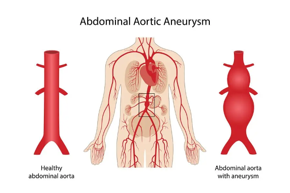{width="100%" style="height: 160px; object-fit: contain; margin-bottom: 20px;"}
<h3 class="text-xl mb-15">Brain Glioblastoma</h3>
<p class="text-lg lh-14" style="color: #666; margin: 0;">Porous frameworks to account for cancer cells diffusion.</p>
:::
:::
:::

::: {.column width="33%"}
::: {.fragment .fade-up}
::: {.eval-card .eval-card-tall style="padding: 25px;"}
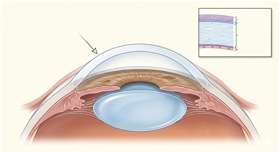{width="100%" style="height: 160px; object-fit: contain; margin-bottom: 20px;"}
<h3 class="text-xl mb-15">Ophthalmology</h3>
<p class="text-lg lh-14" style="color: #666; margin: 0;">Computational models to improve myopia surgery outcomes.</p>
:::
:::
:::

:::

## {data-menu-title="Acknowledgments" visibility="uncounted"}

```{=html}
<div class="ack-sidebar">
    <div class="ack-hashtag">#uni.lu</div>
    
    <div class="ack-links">
        Information: <a href="[https://www.uni.lu](https://www.uni.lu)">www.uni.lu</a><br>
        Virtual Tour: <a href="[https://www.virtualtour.uni.lu](https://www.virtualtour.uni.lu)">www.virtualtour.uni.lu</a>
    </div>

    <div class="ack-socials">
        <div class="social-item"><iconify-icon icon="mdi:facebook"></iconify-icon> Facebook</div>
        <div class="social-item"><iconify-icon icon="mdi:youtube"></iconify-icon> YouTube</div>
        <div class="social-item"><iconify-icon icon="mdi:instagram"></iconify-icon> Instagram</div>
        <div class="social-item"><iconify-icon icon="mdi:at"></iconify-icon> Threads</div>
        <div class="social-item"><iconify-icon icon="mdi:linkedin"></iconify-icon> LinkedIn</div>
        <div class="social-item"><iconify-icon icon="mdi:butterfly"></iconify-icon> Bluesky</div>
    </div>

    <div class="ack-footer">
        <div class="qr-container">
            
        </div>
        <div style="font-size: 15pt; line-height: 1.3;">
            Follow us<br>
            <a href="[https://socialmedia.uni.lu](https://socialmedia.uni.lu)" style="color: white; text-decoration: underline;">socialmedia.uni.lu</a>
        </div>
    </div>
</div>

<div class="red-divider"></div>

<div class="ack-main">
    <div class="big-thanks">Thank <span>You!</span></div>
    <div class="ack-quote">"Predict ulcers before the tissue dies."</div>
    <div class="ack-web">
      <a href="https://th0maslavigne.github.io" style="color: #666; text-decoration: none;">https://th0maslavigne.github.io</a>
    </div>
    <div class="ack-pill">AFR-FNR Grant #17013812</div>
</div>
```

## References

::: {.text-lg .lh-15 .mt-40}
::: {#refs}
:::
:::