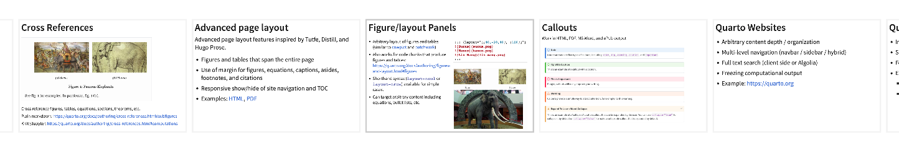
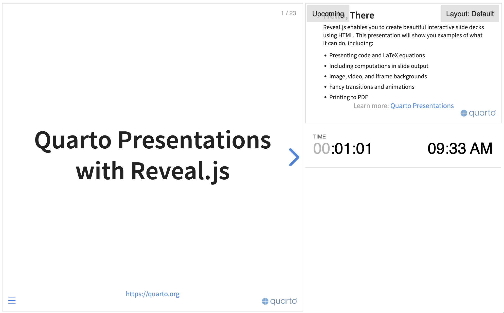

---
format:
  revealjs:
    logo: resources/logos/lms_alone.png
    footer: "Footer text"
    chalkboard: true
    css: resources/pages_style/styles.css
    resources:
      - "resources/**"
    slide-number: c/t
    transition: fade
    width: 1920       
    height: 1080       
    margin: 0.05
    min-scale: 0.2
    max-scale: 2.0
    code-overflow: wrap

bibliography: resources/bibliography/references.bib

title-slide-attributes:
  data-state: "hide-ui"

# ==============================================================================
# 1. TEMPLATE CONFIGURATION (CUSTOM VARIABLES)
# ==============================================================================
title-config:
  # --- Sizing & Layout ---
  sidebar-width: "100px"         
  title-image-size: "450px"      
  logo-height: "65px"            
  content-logo-height: "75px"    

  # --- Core Brand Colors ---
  title-color: "#000000"         
  card-red: "#D3362A"            
  card-blue: "#000000"           
  sidebar-color: "#D3362A"       
  orcid-color: "#A6CE39"  
  circle-header: "#fff700"           
  
  # --- UI & Background Colors ---
  bg-light: "#F9F9F9"            
  bg-light-red: "#FFF5F5"        
  text-main: "#1A1A1A"           
  text-muted: "#666666"          
  subtitle-accent: "#FBC02D"     
  border-main: "#DDDDDD"         
  success-green: "#27AE60"       
  error-red: "#D3362A"           

  # --- Global Typography Scale ---
  title-size: "60pt"             
  subtitle-size: "40pt"          
  author-size: "24pt"            
  footer-size: "16pt"            
  header-size: "40pt"            
  fs-subtitle-silde: "34pt"      
  
  fs-tiny: "13pt"             
  fs-footnote: "14pt"         
  fs-small: "15pt"            
  fs-p-sm: "16pt"             
  fs-base: "14pt"             
  fs-p-lg: "20pt"             
  fs-h6: "24pt"               
  fs-h4: "26pt"               
  fs-h3: "28pt"               
  fs-h2: "30pt"               
  fs-h5: "32pt"               
  fs-h1: "34pt"               
  fs-display-xs: "36pt"       
  fs-display-sm: "40pt"       
  fs-display-md: "55pt"       
  fs-display-lg: "60pt"       
  fs-display-xl: "80pt"       
  fs-display-xxl: "110pt"     
  
  # --- Global Icon Scale ---
  icon-sm: "24px"
  icon-md: "40px"
  icon-lg: "60px"
  icon-xl: "70px"
  icon-xxl: "80px"

# ==============================================================================
# 2. TITLE SLIDE CONTENT
# ==============================================================================
title: "LMS Template Demo"
subtitle: "A complete guide to custom features, layouts, and interactive components."
title-image: "resources/images/skin_microstructure.png" 
email: "your.email@polytechnique.edu"
custom-funding: "Funding: Project #CCCCCCXZ"
jupyter: python3

logos:
  - "resources/logos/lms_alone.png"
  - "resources/logos/cnrs.png"
  - "resources/logos/ip_paris.png"

author:
  - name: "T. Lavigne"
    attributes:       
      presenter: true
    orcid: "0000-0000-0000-0000"
    affiliations:
      - ref: 1
  - name: "A. Colleague"
    attributes:       
      presenter: false
    affiliations:
      - ref: 2 
      - ref: 3 
      - ref: 4

affiliations:
  - id: 1
    name: "Laboratoire de mécanique des solides, UMR 7649, CNRS, École polytechnique, Institut Polytechnique de Paris, Palaiseau, France"
  - id: 2
    name: "Affiliation 2"
  - id: 3
    name: "Affiliation 3"
  - id: 4
    name: "Affiliation 4"
---

# Introduction to the Template

## Welcome to the LMS Quarto Template

This presentation is designed as a foundational guide for researchers and PhD students at the Laboratoire de Mécanique des Solides (LMS). 

It builds upon Quarto and [Reveal.js](https://revealjs.com) to provide a unified, highly stylized format for scientific presentations. In this guide, based on the [official demo](https://quarto.org/docs/presentations/revealjs/demo/#/title-slide), you will learn how to:

- **Configure** the global presentation settings.
- **Utilize** custom CSS grids, data cards, and diagnostic UI components.
- **Bypass** common Reveal.js limitations (like interactive Plotly figures).
- **Leverage** native Reveal.js features (animations, code highlighting, scroll views).

**Note that each time you see a `div` in the template could used `:::` since they are equivalent.**

::: {.mt-0}
```{=html}
<div class="warning-box mt-0 w-100">
  <div class="warning-icon"><iconify-icon icon="mdi:clock-alert-outline"></iconify-icon></div>
  <div class="warning-content">
    <b>Examples:</b> Please look to the examples in `examples/` folder since it provides concrete example of uses (two templates / same content).
  </div>
</div>
```
:::


# Part 1: Configuration Guide

::: {.section-toc .w-75 .h-center .mt-60}

::: {.toc-item .active}
<iconify-icon icon="mdi:play-circle"></iconify-icon> Part 1: Configuration Guide
:::

::: {.toc-item}
<iconify-icon icon="mdi:circle-outline"></iconify-icon> Part 2: Components & Layouts
:::

::: {.toc-item}
<iconify-icon icon="mdi:circle-outline"></iconify-icon> Part 3: Interactive Data Visualization
:::

::: {.toc-item}
<iconify-icon icon="mdi:circle-outline"></iconify-icon> Part 4: Native Reveal.js Capabilities
:::

:::


## The YAML Header: Core Reveal.js Options
::: {.slide-subtitle-area}
Understanding the `format: revealjs` block at the top of your `.qmd` file.
:::

Before writing slides, you must configure the document. Here is what the core parameters control:

::: {.text-xl}

* **`logo`**: The default logo placed on every slide (except the title).
* **`chalkboard: true`**: Activates the drawing/annotation tool overlay (when html opened, press F to slide show, c and b to annotate or board). 
* **`css`**: Points to the custom LMS stylesheet (`styles.css`).
* **`slide-number: c/t`**: Shows "current/total" slide numbers.
* **`transition: fade`**: The default animation between slides (can be `none`, `slide`, `convex`, etc.).
* **`width` / `height`**: Locks the native resolution (1600x900 is standard 16:9).
* **`margin`, `min-scale`, `max-scale`**: Controls how the presentation scales on different screen sizes to prevent layout breaking.

:::

## The YAML Header: Custom LMS Config 
::: {.slide-subtitle-area}
Understanding the custom `title-config` block.
:::

Our custom template reads specific variables under `title-config` to automatically generate the branding.

* **Sizing & Layout**: Controls the exact pixel dimensions of the sidebar (`sidebar-width`), the main title image (`title-image-size`), and the logos.
* **Core Brand Colors**: Sets the primary LMS red (`#D3362A`), card colors, and accent colors. These variables cascade down into the CSS.
* **Typography Scale**: A unified system (`fs-tiny` to `fs-display-xxl`) ensuring font sizes remain mathematically consistent across headers, paragraphs, and footnotes without inline HTML styling.
* **Title Slide Content**: The `title`, `logos`, `author` (with `presenter` toggles), and `affiliations` arrays dynamically assemble the first slide.


## Configuration YAML (`title-config`) {.smaller footer=false}

::: {.slide-subtitle-area}
Comprehensive overview of template customization variables.
:::

::: {.columns .v-center .neg-mt-20}
:::: {.column width="50%"}

### Dimensions & Spacing {.text-2xl}

| Variable | Effect |
| --- | --- |
| `sidebar-width` | Width of the sidebar. |
| `title-image-size` | Size of the circular title image. |
| `logo-height` | Height of the header logos. |
| `content-logo-height` | Height of the logo on content slides. |

### Primary Colors {.text-2xl}

| Variable | Effect |
| --- | --- |
| `title-color` | Color for titles and primary text. |
| `card-red` / `error-red` | Red accent (LMS) and error states. |
| `card-blue` | Dark/blue accent for cards. |
| `sidebar-color` | Sidebar background color. |
| `orcid-color` | ORCID icon color. |
| `bg-light` / `bg-light-red` | Background colors for cards. |
| `success-green` | Validation color (e.g., checkmarks). |
| 

::::

:::: {.column width="50%"}

### Typography (Scale) {.text-2xl}

| Variable | Effect |
| --- | --- |
| `title-size` / `subtitle-size` | Main title and subtitle sizes. |
| `author-size` / `footer-size` | Author and footer text sizes. |
| `header-size` | Size of `##` slide titles. |
| `fs-subtitle-silde` | Slide subtitle size (`.slide-subtitle-area`). |
| `fs-tiny` to `fs-p-lg` | Scale for body text and paragraphs. |
| `fs-h6` to `fs-h1` | Standard heading scale. |
| `fs-display-xs` to `xxl` | Scale for giant metrics (cards). |

### Icons {.text-2xl}

| Variable | Effect |
| --- | --- |
| `icon-sm` to `icon-xxl` | Size scale for `<iconify-icon>` elements. |
| 

::::

:::


# Part 2: Components & Layouts


::: {.section-toc .w-75 .h-center .mt-60}

::: {.toc-item .past}
<iconify-icon icon="mdi:check-circle"></iconify-icon> Part 1: Configuration Guide
:::

::: {.toc-item .active}
<iconify-icon icon="mdi:play-circle"></iconify-icon> Part 2: Components & Layouts
:::

::: {.toc-item}
<iconify-icon icon="mdi:circle-outline"></iconify-icon> Part 3: Interactive Data Visualization
:::

::: {.toc-item}
<iconify-icon icon="mdi:circle-outline"></iconify-icon> Part 4: Native Reveal.js Capabilities
:::

:::


## 1. Grid & Layout Utilities
::: {.slide-subtitle-area}
Using standard Quarto containers (`:::`) combined with LMS utility CSS.
:::

::: {.columns .v-center .neg-mt-40}
:::: {.column width="45%"}
### Spacing & Margin Utilities
Use built-in utility classes to position elements precisely without writing inline CSS.

* **Top Margins:** `.mt-0` up to `.mt-150`
* **Bottom Margins:** `.mb-15` up to `.mb-40`
* **Negative Margins:** `.neg-mt-5` up to `.neg-mt-150` (Great for pulling elements up)
::::

:::: {.column width="45%"}
::: {.info-card .info-card-auto}
<iconify-icon icon="mdi:ruler-square" class="card-icon" style="color: var(--card-blue);"></iconify-icon>

### Width & Flex Classes
* **Widths:** Use `.w-5` through `.w-100` in 5% increments (e.g., `.w-33`, `.w-75`).
* **Flexbox:** `.flex-center` (centers content), `.flex-col` (stacks content vertically).
* **Alignment:** `.text-center`, `.text-left`, `.h-center` (centers a block element).
:::
::::
:::


## 2. Typography & Theming
::: {.slide-subtitle-area}
How to emphasize text natively within Markdown using LMS colors.
:::

::::: {.columns .mt-40}
:::: {.column width="50%"}
### Color Classes
Apply these directly to text spans: `[text]{.classname}`

* [This text is highlighted in Primary Title Color]{.text-title}
* [This text is highlighted in Card Red]{.text-red}
* [This text is highlighted in Subtitle Accent]{.text-accent}

### Typography Classes
* `.text-lg`, `.text-xl`, `.text-2xl`, `.text-3xl`, `.text-4xl`
* `.font-bold`, `.lh-14`, `.lh-15` (line heights)
::::

:::: {.column width="50%"}
### Slide Subtitle Area
To create the yellow subtitle, add this container directly below your slide header:

```markdown
::: {.slide-subtitle-area}
Your subtitle text here.
:::
```

### Citations & Footers
Use custom footers for references at the bottom of the slide:

```markdown
::: {.citation-footer}
**[@Lavigne2024]**
:::
```
::::
:::::


## 3. Standardized Data Cards
::: {.slide-subtitle-area}
Use these containers for displaying metrics and highlighting key data points.
:::

::: {.columns .mt-40}
:::: {.column width="50%"}
### The Blue Card (`.blue-card`)
For standard information and baseline metrics.

::: {.data-card .blue-card}
::: {.card-big-text}
1 in 5
:::
Standard Data Card   
[[@Lavigne2025b]]{.card-ref}
:::
::::

:::: {.column width="50%"}
### The Red Card (`.red-card`)
For highlighted data or critical statistics.

::: {.data-card .red-card}
::: {.card-big-text}
50%
:::
Highlighted Data Card  
[[@Lavigne2025b]]{.card-ref}
:::
::::
:::


## 4. Alerts & Warning Boxes
::: {.slide-subtitle-area}
Use to draw immediate attention to constraints, assumptions, or issues in your models.
:::

::: {.mt-40}
```{=html}
<div class="warning-box mt-0 w-100">
  <div class="warning-icon"><iconify-icon icon="mdi:clock-alert-outline"></iconify-icon></div>
  <div class="warning-content">
    <b>Warning Box:</b> Use <code>.warning-box</code> to draw immediate attention to limitations in boundary conditions or missing data.
  </div>
</div>
```
:::


## 5. Evaluation & Flow Cards
::: {.slide-subtitle-area}
Use these components for comparing methods or showing process workflows.
:::

::::: {.columns .v-center .mt-20}
:::: {.column width="45%"}
```{=html}
<div class="eval-card">
  <h3 class="text-2xl mb-20">Method Evaluation (<code>.eval-card</code>)</h3>
  <ul class="eval-list text-lg">
    <li class="check">Pro: Analytically rigorous.</li>
    <li class="check">Pro: Captures stiffness and creep.</li>
    <li class="cross">Con: Computationally heavy.</li>
    <li class="cross">Con: Difficult to parameterize.</li>
  </ul>
</div>
```
::::

:::: {.column width="55%"}
### Process Flow (`.model-flow`)
For sequential steps, use the flowchart component.

```{=html}
<div class="model-flow mt-20">
  <div class="flow-step shadow-img p-4">
    <div class="flow-title">Step 1</div>
    <iconify-icon icon="mdi:database-search" class="icon-title-large"></iconify-icon>
  </div>
  <div class="flow-operator">➔</div>
  <div class="flow-step shadow-img p-4">
    <div class="flow-title">Step 2</div>
    <iconify-icon icon="mdi:cogs" class="icon-title-large"></iconify-icon>
  </div>
  <div class="flow-operator">➔</div>
  <div class="flow-step shadow-img p-4">
    <div class="flow-title">Step 3</div>
    <iconify-icon icon="mdi:chart-bell-curve" class="icon-title-large"></iconify-icon>
  </div>
</div>
```
::::
:::::


## 6. Diagnostic & Etiology Cards
::: {.slide-subtitle-area}
Specialized visualization components.
:::

::::: {.columns .mt-20}
:::: {.column width="50%"}
### Etiology Long Card
Great for definitions and mechanism breakdowns.

```{=html}
<div class="etiology-long-card">
  <div class="etiology-card-icon">
    <iconify-icon icon="mdi:virus" class="icon-red-md mt-0"></iconify-icon>
  </div>
  <div class="etiology-card-content">
    <div class="etiology-card-title">Primary Pathogenesis</div>
    <p class="etiology-card-text">Detailed description of the fundamental mechanism driving the condition.</p>
  </div>
</div>

<div class="etiology-long-card">
  <div class="etiology-card-icon">
    <iconify-icon icon="mdi:pill" class="icon-red-md mt-0"></iconify-icon>
  </div>
  <div class="etiology-card-content">
    <div class="etiology-card-title">Treatment Pathway</div>
    <p class="etiology-card-text">Secondary considerations regarding interventions and management.</p>
  </div>
</div>
```
::::

:::: {.column width="50%" .neg-mt-150}
### Diagnostic Dead End
For presenting roadblocks or research gaps.

```{=html}
<div class="deadend-card neg-mt-10">
  <div class="deadend-icon-wrapper red-bg">
    <iconify-icon icon="mdi:alert-octagon"></iconify-icon>
  </div>
  <h3 class="deadend-title red-text">Current Limitations</h3>
  
  <div class="colored-bullets w-100">
    <ul>
      <li>Lack of predictive in-vivo models.</li>
      <li>High variance in patients.</li>
    </ul>
  </div>
</div>
```
::::
:::::


## 7. The CV Timeline Component
::: {.slide-subtitle-area}
A responsive, CSS-driven timeline for introducing your background or a project roadmap.
:::

```{=html}
<div class="cv-container w-80">
  <div class="cv-item">
    <div class="cv-left">
      <div class="cv-date">2018 – 2020</div>
    </div>
    <div class="cv-center">
      <div class="cv-dot"></div><div class="cv-line"></div>
    </div>
    <div class="cv-right">
      <div class="cv-title">M1 & Bachelor's in Mechanical Engineering</div>
      <div class="cv-subtitle">ENS Paris-Saclay</div>
    </div>
  </div>

  <div class="cv-item">
    <div class="cv-left">
      <div class="cv-date">2020 – 2024</div>
    </div>
    <div class="cv-center">
      <div class="cv-dot"></div><div class="cv-line"></div>
    </div>
    <div class="cv-right">
      <div class="cv-title">Ph.D. in Biomechanics</div>
      <div class="cv-subtitle">Some University</div>
    </div>
  </div>

  <div class="cv-item">
    <div class="cv-left">
      <div class="cv-date current">2025 – Present</div>
      <div class="cv-icons">
        <iconify-icon icon="mdi:file-document-outline"></iconify-icon>
      </div>
    </div>
    <div class="cv-center">
      <div class="cv-dot current"></div><div class="cv-line"></div>
    </div>
    <div class="cv-right">
      <div class="cv-title">Post-Doctoral Researcher</div>
      <div class="cv-subtitle">École Polytechnique, CNRS</div>
    </div>
  </div>
</div>
```


## 8. Giant Takeaway Overlays
::: {.slide-subtitle-area}
Use full-screen overlays to punctuate the end of a dense section.
:::

<br><br>
You can hide a massive conclusion card in a slide using fragments. 
Click the **right arrow** or press **space** to trigger the overlay.

::: {.fragment .fade-in}
::: {.takeaway-overlay}
::: {.takeaway-card}

The main goal is **not** to create the most complex model, <br>but the **most useful** one.

:::
:::
:::

## 9. Dynamic Section Progress {.text-xl}
::: {.slide-subtitle-area}
A Quarto-native component to track presentation advancement across major parts.
:::

::: {.columns .mt-20}
:::: {.column width="50%"}
### Visual Tracking
Use the `.section-toc` container on your section divider slides. Because it uses pure Quarto `:::` syntax, your markdown remains clean and readable.

**State Classes:**
Change the class on each `.toc-item` to update the visual timeline:

* **`.past`**: Grayed out text. Use the `mdi:check-circle` icon.
* **`.active`**: Highlighted in red and indented. Use the `mdi:play-circle` icon.
* **(Empty)**: Future state. Use the `mdi:circle-outline` icon.
::::

:::: {.column width="50%"}
### Implementation
Drop this directly under your `# Part X` headers.

```markdown
::: {.section-toc .w-90 .h-center}

::: {.toc-item .past}
<iconify-icon icon="mdi:check-circle"></iconify-icon> 
Part 1: Configuration Guide
:::

::: {.toc-item .active}
<iconify-icon icon="mdi:play-circle"></iconify-icon> 
Part 2: Custom Components
:::

::: {.toc-item}
<iconify-icon icon="mdi:circle-outline"></iconify-icon> 
Part 3: Interactive Data
:::
:::
```
::::
:::

## Scrollable Summary Utility Classes (`styles.css`) {.scrollable}
::: {.slide-subtitle-area}
Catalog of ready-to-use macros and CSS classes (Scroll down for more).
:::

::: {.columns .mt-20}
:::: {.column width="100%"}

### Margins and Spacing
* **Top Margins (`margin-top`):** `.mt-0`, `.mt-20`, `.mt-40`, `.mt-50`, `.mt-60`, `.mt-100`, `.mt-150`.
* **Bottom Margins (`margin-bottom`):** `.mb-15`, `.mb-20`, `.mb-30`, `.mb-40`.
* **Negative Margins (Move element up):** `.neg-mt-5` to `.neg-mt-150`.

### Widths (Fluid Grid)
* **5% Increments:** From `.w-5` to `.w-100` (`.w-33` available for thirds).

### Colors and Inline Typography
* **Text Colors:** `[text]{.text-red}`, `[text]{.text-title}`, `[text]{.text-accent}`.
* **Text Sizes:** `.text-lg`, `.text-xl`, `.text-2xl`, `.text-3xl`, `.text-4xl`.
* **Weight and Height:** `.font-bold`, `.lh-14`, `.lh-15` (line-height).

### Visual Components
* **Data Cards:** `::: {.data-card .blue-card}` or `::: {.data-card .red-card}`.
* **Alert Boxes:** `<div class="warning-box">` for limitations or assumptions.
* **Flows and Processes:** `<div class="model-flow">` with `.flow-step` and `.flow-operator`.
* **Evaluation Cards:** `<div class="eval-card">` with `.check` or `.cross` lists.

### Flexbox & Alignment
* **Centering:** `.flex-center` (flexbox), `.text-center` (text), `.h-center` (block).
* **Flex Columns:** `.flex-col` (vertical stacking).

::::
:::

# Part 3: Interactive Data Visualization {background="#fff200"}


::: {.section-toc .w-75 .h-center .mt-60}

::: {.toc-item .past}
<iconify-icon icon="mdi:check-circle"></iconify-icon> Part 1: Configuration Guide
:::

::: {.toc-item .past}
<iconify-icon icon="mdi:check-circle"></iconify-icon> Part 2: Components & Layouts
:::

::: {.toc-item .active}
<iconify-icon icon="mdi:play-circle"></iconify-icon> Part 3: Interactive Data Visualization
:::

::: {.toc-item}
<iconify-icon icon="mdi:circle-outline"></iconify-icon> Part 4: Native Reveal.js Capabilities
:::

:::


## Pretty Code {auto-animate="true"}

-   Over 20 syntax highlighting themes available
-   Default theme optimized for accessibility

``` python
# Define a function to visualize data
def plot_telephones(data, region):
    
    # Initialize the matplotlib figure
    fig, ax = plt.subplots()
```

::: footer
Learn more: [Syntax Highlighting](https://quarto.org/docs/output-formats/html-code.html#highlighting)
:::

## Code Animations {auto-animate="true"}

-   Over 20 syntax highlighting themes available
-   Default theme optimized for accessibility

``` python
# Define a function to visualize data
def plot_telephones(data, region):
    
    # Initialize the matplotlib figure
    fig, ax = plt.subplots()
    ax.bar(data['Year'], data[region] * 1000)
    ax.set_title(region)
    ax.set_ylabel("Number of Telephones")
    ax.set_xlabel("Year")
```

::: footer
Learn more: [Code Animations](https://quarto.org/docs/presentations/revealjs/advanced.html#code-animations)
:::

## Interactive 2D Graphics (Plotly Fix)
::: {.slide-subtitle-area}
How to bypass the transparent Chalkboard layer blocking hover events.
:::

::: {.columns .v-center}
:::: {.column width="40%"}
**The Problem:** The Reveal.js `chalkboard` plugin casts an invisible layer over the slide, breaking interactivity on HTML widgets.

**The Fix:** Convert the Plotly figure to raw HTML and wrap it in an `<iframe>` using Python.

```python
# Create your plotly figure 'fig'
raw = fig.to_html(full_html=True)
iframe = f'<iframe srcdoc="{html.escape(raw)}" style="width: 100%; height: 450px; border:none;"></iframe>'
display(HTML(iframe))
```
::::

:::: {.column width="60%"}
```{python}
#| echo: false
#| eval: true
import plotly.graph_objects as go
import numpy as np
import html as html_lib
from IPython.display import display, HTML

t = np.linspace(0, 10, 100)
y = np.exp(-t/3) * np.cos(2*np.pi*t)

fig = go.Figure(layout=go.Layout(
    title="Interactive Damped Oscillation",
    plot_bgcolor='rgba(0,0,0,0)', 
    paper_bgcolor='rgba(0,0,0,0)',
    height=400, width=700
))
fig.add_trace(go.Scatter(x=t, y=y, mode='lines', line=dict(color='#D3362A', width=3)))

raw_html = fig.to_html(full_html=True, include_plotlyjs='cdn')
iframe = f'<iframe srcdoc="{html_lib.escape(raw_html)}" style="width: 100%; height:450px; border:none; border-radius: 12px; box-shadow: 0 10px 30px rgba(0,0,0,0.1);"></iframe>'
display(HTML(iframe))
```
::::
:::


## Interactive 3D Graphics
::: {.slide-subtitle-area}
The exact same iframe wrapping technique applies to complex 3D plots.
:::

::: {.columns .v-center}
:::: {.column width="40%"}
Using Plotly's `Surface` or `Scatter3d`, you can embed fully rotatable models directly into your presentation. 

This is highly effective for visualizing stress tensors, yield surfaces, or topological data. Hover over the plot and click and drag to rotate the camera.
::::

:::: {.column width="60%"}
```{python}
#| echo: false
#| eval: true
import plotly.graph_objects as go
import numpy as np
import html as html_lib
from IPython.display import display, HTML

# Generate 3D surface data
x = np.outer(np.linspace(-2, 2, 30), np.ones(30))
y = x.copy().T
z = np.cos(x ** 2 + y ** 2)

fig = go.Figure(data=[go.Surface(z=z, x=x, y=y, colorscale='Reds')])
fig.update_layout(
    title="3D Interactive Cosine Surface",
    autosize=False, width=700, height=450,
    margin=dict(l=0, r=0, b=0, t=40),
    paper_bgcolor='rgba(0,0,0,0)',
    scene=dict(xaxis_title='X', yaxis_title='Y', zaxis_title='Z')
)

raw_html = fig.to_html(full_html=True, include_plotlyjs='cdn')
iframe = f'<iframe srcdoc="{html_lib.escape(raw_html)}" style="width: 100%; height:480px; border:none; border-radius: 12px; box-shadow: 0 10px 30px rgba(0,0,0,0.1);"></iframe>'
display(HTML(iframe))
```
::::
:::


## Interactive Slides (Folium) {.smaller transition="slide"}
::: {.slide-subtitle-area}
Include standard Python widgets effortlessly.
:::

```{python}
#| echo: false
import folium

# Set precise width and height directly in the Map constructor
m = folium.Map(
    location=[52.356, 4.953], 
    zoom_start=12,
    width='100%',   # Forces the map to fill the column/slide width
    height=600      # Sets the height to exactly 500 pixels
)

folium.Marker(
    location=[52.356, 4.953],
    popup="The birthplace of Python"
).add_to(m)

m
```


## Interactive Slides (Observable) {.smaller transition="slide"}

Turn presentations into applications with Observable JS. Use component layout to position inputs and outputs.


```{python}
#| echo: false
import pandas as pd
import numpy as np

# Prepare the data in Python
df = pd.DataFrame({
  "x": np.random.randn(100),
  "y": np.random.randn(100)
})

# Pass the data to the OJS context
ojs_define(actors = df)
```

::: {.columns .v-center .h-center .w-90 .mt-150}
:::: {.column width="35%"}

```{ojs}
//| panel: sidebar
// UI components must be in an {ojs} block, NOT {python}
viewof talentWeight = Inputs.range([-2, 2], { value: 0.7, step: 0.01, label: "talent weight" })
viewof looksWeight = Inputs.range([-2, 2], { value: 0.7, step: 0.01, label: "looks weight" })
viewof minimum = Inputs.range([-2, 2], { value: 1, step: 0.01, label: "min fame" })
```

::::

:::: {.column width="65%"}

```{ojs}
//| panel: fill
// Logic and visualization also go in an {ojs} block
import { plotActors } from './actors.js';
plotActors(actors, talentWeight, looksWeight, minimum)
```

::::
:::


# Part 4: Native Reveal.js Capabilities

::: {.section-toc .w-75 .h-center .mt-60}

::: {.toc-item .past}
<iconify-icon icon="mdi:check-circle"></iconify-icon> Part 1: Configuration Guide
:::

::: {.toc-item .past}
<iconify-icon icon="mdi:check-circle"></iconify-icon> Part 2: Components & Layouts
:::

::: {.toc-item .past}
<iconify-icon icon="mdi:check-circle"></iconify-icon> Part 3: Interactive Data Visualization
:::

::: {.toc-item .active}
<iconify-icon icon="mdi:play-circle"></iconify-icon> Part 4: Native Reveal.js Capabilities
:::

:::


## Code Highlighting & Execution

::: {.slide-subtitle-area}
Quarto allows you to highlight specific lines and execute code live in the presentation.
:::

::: {.columns}
:::: {.column width="50%"}
### Highlight Specific Lines
Focus audience attention progressively.

``` {.python code-line-numbers="2|4-5|8"}
import numpy as np
import pandas as pd

def calculate_stress(force, area):
    return force / area

# Main execution
stress = calculate_stress(100, 2)
```
::::

:::: {.column width="50%"}
### Execute & Print Output
Run Python directly in the slide.

```{python}
#| echo: true
import pandas as pd
df = pd.DataFrame({
  "Material": ["Steel", "Bone", "Rubber"], 
  "E (GPa)": [200, 15, 0.05]
})
print(df)
```

::::

:::


## Other script
```{python}
#| echo: true
#| eval: true
#| fig-width: 5
#| fig-height: 3
import seaborn as sns
import matplotlib.pyplot as plt

mpg = sns.load_dataset("mpg")
sns.scatterplot(data=mpg, x="horsepower", y="mpg", color="#D3362A")
plt.show()
```


## LaTeX Equations
::: {.slide-subtitle-area}
MathJax rendering of complex equations.
:::

::: columns
::: {.column width="40%"}
```tex
\begin{gather*}
a_1=b_1+c_1\\
a_2=b_2+c_2-d_2+e_2
\end{gather*}

\begin{align}
\sigma_{ij} &= C_{ijkl} \varepsilon_{kl}\\
\nabla \cdot (k \nabla p) &= \frac{\partial p}{\partial t}
\end{align}
```
:::

::: {.column width="60%"}
```{=tex}
\begin{gather*}
a_1=b_1+c_1\\
a_2=b_2+c_2-d_2+e_2
\end{gather*}
```

```{=tex}
\begin{align}
\sigma_{ij} &= C_{ijkl} \varepsilon_{kl}\\
\nabla \cdot (k \nabla p) &= \frac{\partial p}{\partial t}
\end{align}
```
:::
:::


## Incremental Lists & Fragments
::: {.slide-subtitle-area}
Control the flow of information step-by-step.
:::

::: columns
::: {.column width="50%"}
### Incremental Lists
Use `::: incremental` to pause between bullets.

::: incremental
-   First point to consider.
-   Second point, appearing on next click.
-   Final conclusion.
:::
:::

::: {.column width="50%"}
### Animation Fragments
Apply fragment classes to any element.

::: {.fragment .fade-in}
Fade in (`.fragment .fade-in`)
:::

::: {.fragment .fade-up}
Slide up (`.fragment .fade-up`)
:::

::: {.fragment .highlight-red}
Highlight red (`.fragment .highlight-red`)
:::
:::
:::

## Fragments

Incremental text display and animation with fragments:

<br/>

::: {.fragment .fade-in}
Fade in
:::

::: {.fragment .fade-up}
Slide up while fading in
:::

::: {.fragment .fade-left}
Slide left while fading in
:::

::: {.fragment .fade-in-then-semi-out}
Fade in then semi out
:::

. . .

::: {.fragment .strike}
Strike
:::

::: {.fragment .highlight-red}
Highlight red
:::

::: footer
Learn more: [Fragments](https://quarto.org/docs/presentations/revealjs/advanced.html#fragments)
:::

## Slide Backgrounds {background="#43464B"}

Set the `background` attribute on a slide to change the background color (all CSS color formats are supported).

Different background transitions are available via the `background-transition` option.

::: footer
Learn more: [Slide Backgrounds](https://quarto.org/docs/presentations/revealjs/#color-backgrounds)
:::


## Media Backgrounds {background="#43464B" background-image="resources/images/milky-way.jpeg"}
::: {.slide-subtitle-area}
Change backgrounds using slide attributes.
:::

You can use the following as a slide background:

-   A color: `{background="#43464B"}`
-   An image: `{background-image="resources/images/photo.jpeg"}`
-   A video: `{background-video="video.mp4"}`
-   An iframe: `{background-iframe="url"}`


## Absolute Position

Position images or other elements at precise locations

{.absolute top="250" left="30" width="400" height="400"}

{.absolute .fragment top="250" right="80" width="800"}

{.absolute .fragment bottom="50" right="550" width="600"}


::: {.aside}
This is an aside
:::

::: {.citation-footer}
Learn more: [Absolute Position](https://quarto.org/docs/presentations/revealjs/advanced.html#absolute-position)
:::


## Auto-Animate {auto-animate="true" auto-animate-easing="ease-in-out"}
::: {.slide-subtitle-area}
Automatically animate matching elements across slides.
:::

::: r-hstack
::: {data-id="box1" auto-animate-delay="0" style="background: #2780e3; width: 200px; height: 150px; margin: 10px;"}
:::

::: {data-id="box2" auto-animate-delay="0.1" style="background: #3fb618; width: 200px; height: 150px; margin: 10px;"}
:::

::: {data-id="box3" auto-animate-delay="0.2" style="background: #D3362A; width: 200px; height: 150px; margin: 10px;"}
:::
:::

*Transition to the next slide to see the effect...*


## Auto-Animate {auto-animate="true" auto-animate-easing="ease-in-out"}
::: {.slide-subtitle-area}
Automatically animate matching elements across slides.
:::

::: r-stack
::: {data-id="box1" style="background: #2780e3; width: 350px; height: 350px; border-radius: 200px;"}
:::

::: {data-id="box2" style="background: #3fb618; width: 250px; height: 250px; border-radius: 200px;"}
:::

::: {data-id="box3" style="background: #D3362A; width: 150px; height: 150px; border-radius: 200px;"}
:::
:::

## Slide Transitions {.smaller}

The next few slides will transition using the `slide` transition

| Transition | Description                                                            |
|------------|------------------------------------------------------------------------|
| `none`     | No transition (default, switch instantly)                              |
| `fade`     | Cross fade                                                             |
| `slide`    | Slide horizontally                                                     |
| `convex`   | Slide at a convex angle                                                |
| `concave`  | Slide at a concave angle                                               |
| `zoom`     | Scale the incoming slide so it grows in from the center of the screen. |

::: footer
Learn more: [Slide Transitions](https://quarto.org/docs/presentations/revealjs/advanced.html#slide-transitions)
:::


## Tabsets {.scrollable transition="slide"}
::: {.slide-subtitle-area}
Organize dense information, equations, and code blocks using interactive tabs.
:::

::: panel-tabset
### Plot
```{python}
#| fig-height: 3
import seaborn as sns
import matplotlib.pyplot as plt

mpg = sns.load_dataset("mpg")
sns.lmplot(x="horsepower", y="mpg", hue="origin", data=mpg, height=3, aspect=2)
plt.show()
```

### Data
```{python}
import seaborn as sns
mpg = sns.load_dataset("mpg")
mpg.head(5)
```

### Governing Equations
$$
\sigma_{ij} = C_{ijkl} \varepsilon_{kl} - \alpha_{ij} \Delta T
$$
$$
\nabla \cdot (k \nabla p) + Q = \frac{\partial p}{\partial t}
$$
:::


## Presenter Tools 
::: {.slide-subtitle-area}
Built-in Reveal.js tools mapped to your keyboard.
:::

* **Chalkboard ():** Press **** to toggle the chalkboard to draw on a blank canvas.
* **Canvas ():** Press **** to draw directly over your current slide.
* **Overview ():** Press **** to toggle a bird's-eye view of your entire presentation.
* **Speaker View ():** Press **** to open a dual-screen presenter display with notes and timers.
* **Scroll View ():** Press **** to convert the presentation into a continuous scrolling document (great for exporting to PDF or reading offline).

## Easy Navigation

::: {style="margin-bottom: 0.9em;"}
Quickly jump to other parts of your presentation
:::

::: {layout="[1, 20]"}
{width="41"}

Toggle the slide menu with the menu button (bottom left of slide) to go to other slides and access presentation tools.
:::

You can also press  to toggle the menu open and closed.

You can also press  to toggle 'Jump To Slide' modal box to quickly go to one of your slide using its number or id.


## Jump To Slide

::: {style="margin-bottom: 0.9em;"}
Quickly jump to other parts of your presentation
:::

## Chalkboard {chalkboard-buttons="true"}

::: {style="margin-bottom: 0.9em;"}
Free form drawing and slide annotations
:::

::: {layout="[1, 20]"}
{width="41"}

Use the chalkboard button at the bottom left of the slide to toggle the chalkboard.
:::

::: {layout="[1, 20]"}
{width="41"}

Use the notes canvas button at the bottom left of the slide to toggle drawing on top of the current slide.
:::

You can also press  to toggle the chalkboard or  to toggle the notes canvas.

::: footer
Learn more: [Chalkboard](https://quarto.org/docs/presentations/revealjs/presenting.html#chalkboard)
:::

## Point of View

press  to toggle overview mode:

{.border}

Hold down the  and click on any element to zoom towards it---try it now on this slide.

::: footer
Learn more: [Overview Mode](https://quarto.org/docs/presentations/revealjs/presenting.html#overview-mode), [Slide Zoom](https://quarto.org/docs/presentations/revealjs/presenting.html#slide-zoom)
:::

## Speaker View

press  (or use the tools in presentation menu) to open speaker view

{fig-align="center" style="border: 3px solid #dee2e6;" width="780"}

::: footer
Learn more: [Speaker View](https://quarto.org/docs/presentations/revealjs/presenting.html#speaker-view)
:::

## Scroll View {#scroll-view}

Press  (or use the tools in presentation menu) to open scroll view

Try it now on this slide --- You'll see a scroll bar on the right and you can scroll down the presentation using your mouse.

Scroll view behavior can be configured using `scroll-view` configuration. 

::: footer
Learn more: [Scroll View](https://quarto.org/docs/presentations/revealjs/presenting.html#scroll-view)
:::


## {data-menu-title="Acknowledgments" visibility="uncounted"}

```{=html}
<div class="ack-sidebar">
    <div class="ack-hashtag">#LMS</div>
    
    <div class="ack-links">
        Information: <a href="https://lms.ip-paris.fr">lms.ip-paris.fr</a><br>
        Group @ LMS: <a href="https://th0maslavigne.github.io/LMS_Biomechanics/home.html">LMS_Biomechanics</a>
    </div>

    <div class="ack-socials">
        <div class="social-item"><iconify-icon icon="mdi:facebook"></iconify-icon> Facebook</div>
        <div class="social-item"><iconify-icon icon="mdi:youtube"></iconify-icon> YouTube</div>
        <div class="social-item"><iconify-icon icon="mdi:instagram"></iconify-icon> Instagram</div>
        <div class="social-item"><iconify-icon icon="mdi:at"></iconify-icon> Threads</div>
        <div class="social-item"><iconify-icon icon="mdi:linkedin"></iconify-icon> LinkedIn</div>
        <div class="social-item"><iconify-icon icon="mdi:butterfly"></iconify-icon> Bluesky</div>
    </div>

    <div class="ack-footer">
        <div class="qr-container-white">
            
        </div>
        <div style="font-size: 15pt; line-height: 1.3;">
            Visit us.<br>
            <a href="[https://lms.ip-paris.fr/contactez-nous](https://lms.ip-paris.fr/contactez-nous)" style="color: white; text-decoration: underline;">contact us</a>
        </div>
    </div>
</div>

<div class="red-divider"></div>

<div class="ack-main">
    <div class="big-thanks">Thank <span>You!</span></div>
    <div class="ack-quote">"Enjoy."</div>
    <div class="ack-web">
      <a href="https://XXXX.github.io" style="color: #666; text-decoration: none;">some link</a>
    </div>
    <div class="ack-pill">Goog luck</div>
</div>
```

## References

::: {.text-lg .lh-15 .mt-40}
::: {#refs}
:::
:::